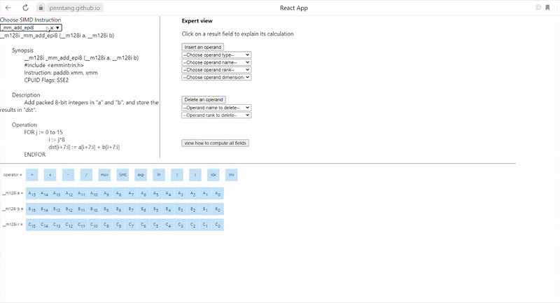

# Live Version found here 
[https://pmntang.github.io/SIMDGiraffe](https://pmntang.github.io/SIMDGiraffe)

Interaction of the expert with SIMDGiraffe to create, in the expert view, a visual representation of the intrinsic function _mm512_mask_add_ps. The result of the entire interaction process for this intrinsic function is available in the novice view.

Interaction of the expert with SIMDGiraffe to create, in the expert view, a visual representation of the intrinsic function _mm_shuffle_epi32. The result of the entire interaction process for this intrinsic function is available in the novice view.

# But wait, what is SIMD?
SIMD (pronounced "seem-dee") is short for **Single Instruction, Multiple Data** which is one [classification of computer architectures](https://en.wikipedia.org/wiki/Flynn%27s_taxonomy "classification of computer architectures"). SIMD allows one same operation to be performed on multiple data points resulting in data level parallelism and thus performance gains, for example for 3D graphics and video processing, physics simulations or cryptography, and other domains.

# Why would one need to visualize it?
The first time I saw SIMD code, I almost had a heart attack.  My brain was overwhelmed, my stress level rose, my face turned white like a sheet of paper and cold sweats started to flow all over my body.  SIMD code is not designed to be easily understood by human brain, it's similar to assembly code, it's made for machines.

The thing is, we still need SIMD. It's powerful and once you understand what it does, it's quite simple. So, how do we understand what it does then?  We visualize it!  We make it look simple with animations and colors!

Our goal is to experiment with different visualization methods, until we figure out the ones that are so easy to understand that even our grandmothers would think it's a kids play. For now, we think we found a solution that allows anyone with basic knowledge of algebra to understand any given SIMD instruction or precisely its intrinsic equivalent, quickly and free of hearth attacks. 

# Basic Features
- Capturing Expert Explanation.
- Semantic SIMD visualization.
- Graphical Visualization. 🔥🔥
- Explain SIMD instructions/intrinsics. 😮😍

# How does it work?

It depends on the view you choose: the novice view or the expert view; but most, if not all, actions and operations are done with a mouse click.
The expert view is to explain the operation of a vector instruction, an intrinsic. The novice view is to see the traces left by the expert, through the expert view, during his explanation. So, if there was no interaction of the expert with SIMDGiraffe, the novice view has nothing.

For example, from the expert view, if you want to explain the vector instruction **_mm512_mask_add_ps**, you must choose a scalar field from the result vector. For the particular case of this vector instruction, you must use the scalar operators **+**, **x** and **Inv** to connect each result scalar field to the corresponding operand scalar fields.

The operator **Idx** *(indexing)* is defined by **<code>A *Idx* B = AB</code>**. Apart from **Idx** and **Inv**, the other operators are those of elementary arithmetic and retain their semantics of elementary arithmetic.

## Available Scripts

In the project directory, you can run:
### `npm start` or `yarn start` 

Runs the app in the development mode.
Open [http://localhost:3000](http://localhost:3000) to view it in the browser.
The page will reload if you make edits.
You will also see any lint errors in the console.
### `npm run build` 

Builds the app for production to the `build` folder.
It correctly bundles React in production mode and optimizes the build for the best performance.

The build is minified and the filenames include the hashes.
Your app is ready to be deployed!

### `npm run deploy`

Deploys application to github-pages.  It will build, then push the code to gh-pages branch.

### `npm test`

Launches the test runner in the interactive watch mode.
See the section about [running tests](#running-tests) for more information.

# Credits

This project is made possible by [Pierre Marie Ntang](https://github.com/pmntang).  It is part of his PhD thesis in congnitive computing at [Université du Québec (TELUQ)](https://www.teluq.ca/site/en/). Thanks to [Jeremie Piotte](https://github.com/piotte13) who laid the foundation of [SIMD-Visualiser](https://github.com/piotte13/SIMD-Visualiser) during an internship in our lab at Teluq. The ideas of this software were first reused in [SIMDGiraffe](https://github.com/pmntang/SIMDGiraffe), but were later completely abandoned due to a pitfall trap related to wrong data abstraction.

Thanks to [Daniel Lemire](https://github.com/lemire) for his many ideas and his deep knowledge and expertise in SIMD software.  He is well known in the open source world as well as the big data community. His work is used by companies such as eBay, Facebook, LinkedIn and Netflix in their data warehouses. Git also uses his techniques to accelerate queries.

# License
The [BSD 3-clause](https://tldrlegal.com/license/bsd-3-clause-license-(revised)) license allows you almost unlimited freedom with the software so long as you include the BSD copyright and license notice in it (found in Fulltext).